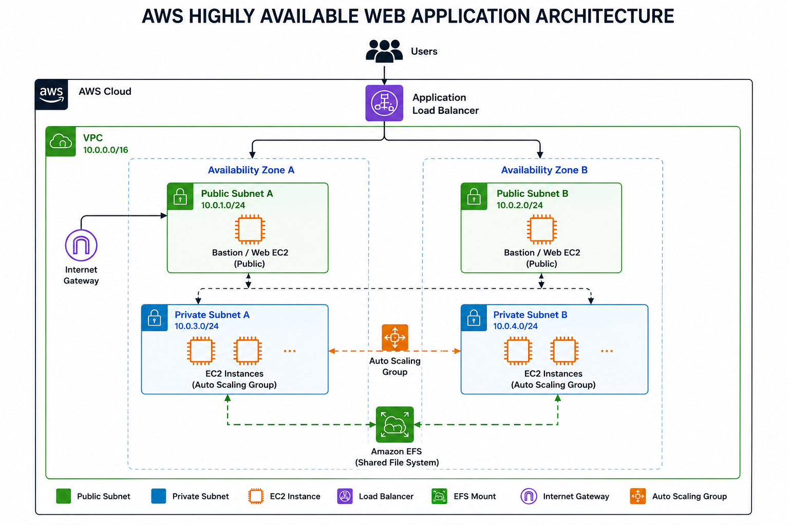

# AWS Highly Available Web Application using EC2, Amazon EFS, Auto Scaling Group & Application Load Balancer


---

# 📖 Project Overview

This project demonstrates how to deploy a **Highly Available and Scalable Web Application** on AWS using industry-standard cloud architecture.

The infrastructure is designed using a **custom Virtual Private Cloud (VPC)** spanning **two Availability Zones**, with an **Application Load Balancer (ALB)** distributing traffic across EC2 instances managed by an **Auto Scaling Group (ASG)**.

To ensure that all web servers serve identical content, **Amazon Elastic File System (EFS)** is mounted on every EC2 instance, allowing all instances to share the same website files.

This architecture provides:

- High Availability
- Fault Tolerance
- Automatic Scaling
- Shared Storage
- Load Balancing
- Multi-AZ Deployment

---

# 🏗 Architecture


with:

```markdown
# 🏗 Architecture



```

---

# 🚀 AWS Services Used

| AWS Service | Purpose |
|------------|---------|
| Amazon VPC | Network Isolation |
| Public Subnets | Host Public Resources |
| Private Subnets | Host Auto Scaling EC2 Instances |
| Internet Gateway | Internet Connectivity |
| Route Tables | Traffic Routing |
| Amazon EC2 | Web Server |
| Amazon EFS | Shared File Storage |
| Security Groups | Firewall Rules |
| AMI | Golden Image for Auto Scaling |
| Launch Template | EC2 Configuration |
| Auto Scaling Group | Automatic Scaling |
| Target Group | Registers EC2 Instances |
| Application Load Balancer | Traffic Distribution |

---

# 📌 Architecture Overview

The architecture consists of:

- One custom VPC
- Two Public Subnets
- Two Private Subnets
- Two Availability Zones
- One Public EC2 Instance for initial setup
- Amazon EFS with Mount Targets in both Availability Zones
- Apache Web Server
- Custom HTML Web Page
- Amazon Machine Image (AMI)
- Launch Template
- Auto Scaling Group
- Application Load Balancer

All Auto Scaling instances mount the same EFS file system, ensuring centralized website content.

---

# 🌐 Network Design

## VPC

```
CIDR: 10.0.0.0/16
```

---

## Public Subnets

- Public Subnet A
- Public Subnet B

Used for:

- Application Load Balancer
- Initial EC2 Instance

---

## Private Subnets

- Private Subnet A
- Private Subnet B

Used for:

- Auto Scaling EC2 Instances

---

# 🔐 Security Group Configuration

| Port | Protocol | Purpose |
|------|----------|---------|
|22|TCP|SSH|
|80|TCP|HTTP|
|2049|TCP|NFS (Amazon EFS)|

> **Note:** In this learning project, NFS (2049) was temporarily opened broadly to simplify testing. In a production environment, EFS access should be restricted to the EC2 instances' security group.

---

# 💾 Amazon EFS Setup

Amazon Elastic File System was created to provide centralized shared storage for all EC2 instances.

The EFS was mounted on:

```
/var/www/html
```

As a result:

- Every EC2 instance shares the same website files.
- Updating the website in the mounted directory is reflected across all instances.

---

# 🌍 Apache Web Server

Apache HTTP Server was installed on the EC2 instance.

The web application was deployed inside:

```
/var/www/html
```

Since this directory is backed by Amazon EFS, every Auto Scaling instance automatically serves the same website after mounting the file system.

---

# 📦 Amazon Machine Image (AMI)

After configuring:

- Apache
- Amazon EFS
- Website Files

An Amazon Machine Image (AMI) was created.

This AMI is used as the base image for the Launch Template.

---

# ⚙ Launch Template

The Launch Template includes:

- Amazon Machine Image (AMI)
- Instance Type
- Security Group
- Key Pair

This template is used by the Auto Scaling Group to launch new EC2 instances.

---

# 📈 Auto Scaling Group

The Auto Scaling Group was configured to:

- Launch EC2 instances across two Availability Zones
- Maintain desired capacity
- Replace unhealthy instances automatically
- Register new instances with the Load Balancer

---

# ⚖ Application Load Balancer

The Application Load Balancer distributes incoming HTTP requests across all healthy EC2 instances.

Features:

- Internet Facing
- HTTP Listener (Port 80)
- Target Group Integration
- Health Checks
- Multi-AZ Traffic Distribution

---

# 🔄 Project Workflow

```
Internet
      │
      ▼
Application Load Balancer
      │
      ▼
Auto Scaling Group
      │
 ┌───────────────┐
 │               │
 ▼               ▼
EC2 Instance   EC2 Instance
      │               │
      └──────┬────────┘
             │
             ▼
        Amazon EFS
             │
             ▼
 Shared Website Files
```

---

# 📂 Project Structure

```
aws-highly-available-web-application/
│
├── README.md
├── architecture/
│   └── aws-ha-webapp-architecture.png
│
├── website/
│   └── index.html
│
├── screenshots/
│
└── docs/
```

---

# 📷 Screenshots

Include screenshots for:

- VPC
- Public Subnets
- Private Subnets
- Route Tables
- Internet Gateway
- Security Groups
- EC2 Instance
- Amazon EFS
- EFS Mount Targets
- Mounted EFS (`df -h`)
- Apache Installation
- Website Output
- AMI
- Launch Template
- Auto Scaling Group
- Target Group
- Application Load Balancer
- Healthy Targets
- Load Balancer DNS Output

---

# ✅ Verification

The deployment was verified by:

- Successfully mounting Amazon EFS on all EC2 instances.
- Accessing the application using the Application Load Balancer DNS.
- Confirming that all instances serve the same web page from the shared EFS.
- Verifying healthy targets in the Target Group.
- Testing automatic traffic distribution through the Load Balancer.

---

# 🎯 Learning Outcomes

This project provided hands-on experience with:

- Designing custom AWS networking using VPC.
- Creating public and private subnets across multiple Availability Zones.
- Configuring Security Groups and Route Tables.
- Deploying Apache Web Server on EC2.
- Implementing shared storage with Amazon EFS.
- Creating reusable Amazon Machine Images (AMI).
- Configuring Launch Templates.
- Deploying an Auto Scaling Group.
- Configuring an Application Load Balancer.
- Building a highly available and fault-tolerant web application architecture.

---

# 🚀 Future Enhancements

Potential improvements include:

- Restrict Amazon EFS access to the EC2 security group.
- Use User Data scripts to automate EFS mounting during instance launch.
- Add a NAT Gateway for outbound internet access from private subnets.
- Enable HTTPS using AWS Certificate Manager (ACM).
- Configure Amazon Route 53 for a custom domain.
- Add CloudWatch monitoring and alarms.
- Enable ALB access logging to Amazon S3.
- Provision the infrastructure using Terraform.

---

# 👨‍💻 Author

**Harsha Vardhan G**

Cloud & DevOps Enthusiast

GitHub: https://github.com/HarshaVardhan525

LinkedIn: *(Add your LinkedIn profile URL here)*

---

# ⭐ If you found this project useful, consider giving it a star!
